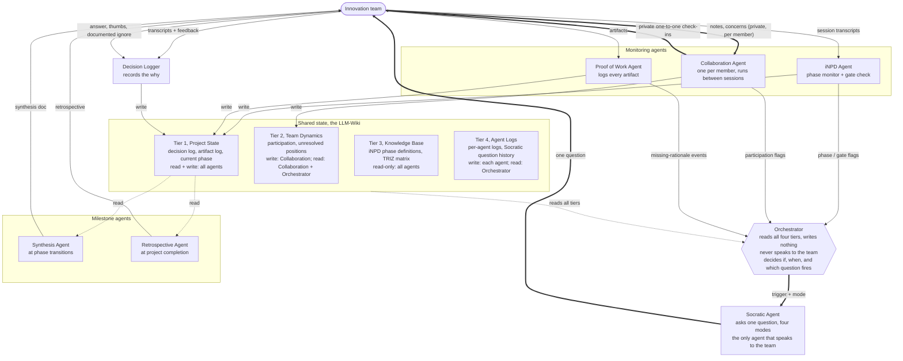

# System Architecture Diagram

A flow view of the design in [[innovation-team-agent-architecture]]. The team is the only human in the loop. Two agents are team-facing: the Socratic Agent addresses the whole team with one shared question, and each member has their own Collaboration Agent for a private, one-to-one channel (post-session notes, concerns, complaints). The Orchestrator coordinates but never speaks. Each tier box states who may read and write it.

## How to read it

Solid arrows are writes and message passing. Dotted arrows are reads. The thick arrows are the single live intervention path: the Orchestrator triggers the Socratic Agent with a mode, the Socratic Agent asks the team one question, and the team's answer flows to the Decision Logger as the record of why.

Reads not drawn, to keep the graph legible, are stated in each tier box and in the [[innovation-team-agent-architecture]] tier table: the iNPD and Socratic agents read Tier 3 (phase definitions, TRIZ matrix), the Collaboration agents read Tier 1, the Decision Logger reads Tier 4 (the Socratic question history), and the Orchestrator reads all four tiers.

The two rules the diagram is built to enforce: the LLM never decides, so every output is a question or a read, and the team is addressed in only two ways, the Socratic Agent's single question to the whole group and each member's private Collaboration Agent. What a member tells their Collaboration Agent stays private; if it warrants a team-level response, that goes out as a neutral, de-identified Socratic question, never as "someone complained."
